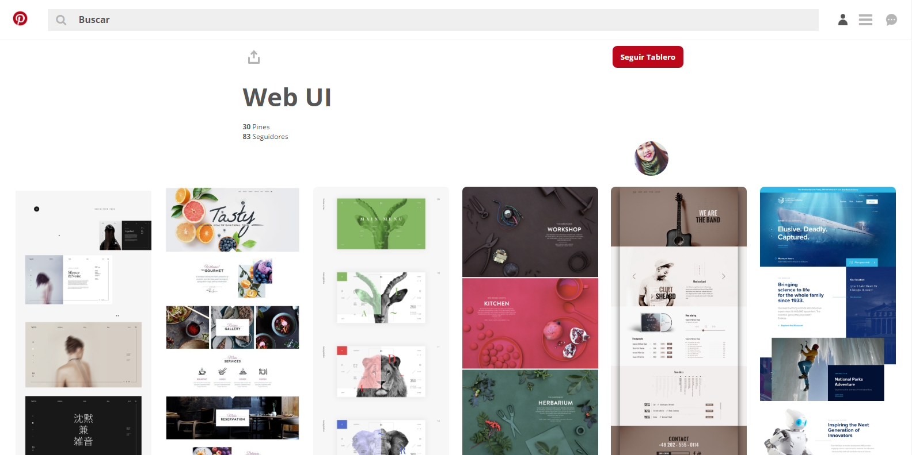
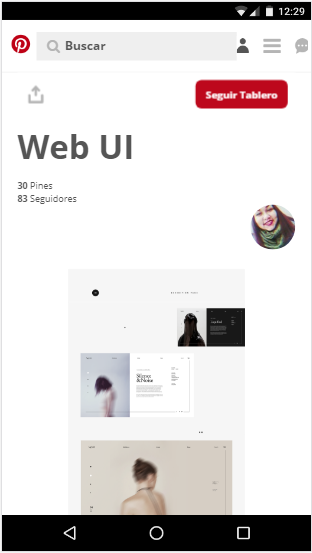

# project-pinterest


## Descripción
Este proyecto está constituido por la replica de PINTEREST, la cual es es una plataforma para compartir imágenes que permite a los usuarios crear y administrar, en tableros personales temáticos, colecciones de imágenes como eventos, intereses, hobbies y mucho más. 

## Requerimientos
   ```sh
  - SASS
  - GULP
  - COMPONENTES
```
## RECURSOS UTILIZADOS
   ```sh
  - SASS
  - GULP
  - COMPONENTES
  - FLEX 
  - HTML
  - CSS
  - JS
  - NODE.JS
```
## Muestra del Proyecto
+ Mobile  <br/>
  
  
 + Desktop <br/>
  


## Créditos

- [Ruth Salvador](https://github.com/RuthSalvador). <br/>
- [Miriam Mendoza](https://github.com/mgmp2). <br/>
- [Mitchell Rodríguez](https://github.com/mishrole). <br/>
 

`Nota`:

- Este proyecto está subido al HEROKU [aquí](https://project-pinterest.herokuapp.com/).<br/>
- Este proyecto está subido al GH-PAGES [aquí](https://ruthsalvador.github.io/project-pinterest/public/index.html).

